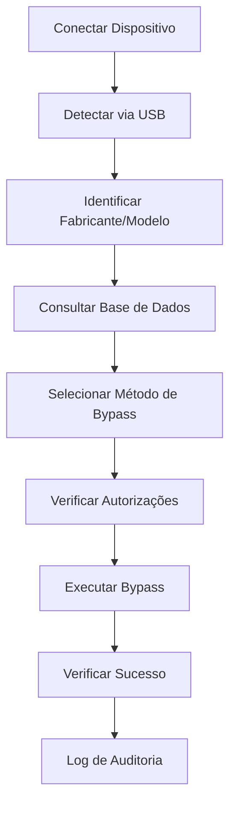

# FRP Bypass Professional v1.0.0

[](https://python.org)
[](LICENSE)
[](README.md)

**Software profissional para bypass de FRP (Factory Reset Protection) em dispositivos Android.**

## ⚠️ AVISO LEGAL IMPORTANTE

**ESTE SOFTWARE DEVE SER USADO EXCLUSIVAMENTE PARA FINS LEGÍTIMOS E AUTORIZADOS**

- ✅ Use apenas em dispositivos próprios
- ✅ Use apenas com autorização expressa do proprietário
- ✅ Para fins de recuperação legítima de dispositivos
- ✅ Para fins educacionais e de pesquisa

- ❌ NÃO use em dispositivos roubados
- ❌ NÃO use para atividades ilegais
- ❌ NÃO use sem autorização do proprietário
- ❌ NÃO use para contornar medidas de segurança legítimas

**O usuário é inteiramente responsável pelo uso adequado e legal desta ferramenta. Os desenvolvedores não se responsabilizam por uso indevido.**

---

## 📋 Índice

- [Características](#-características)
- [Requisitos do Sistema](#-requisitos-do-sistema)
- [Instalação](#-instalação)
- [Uso Básico](#-uso-básico)
- [Dispositivos Suportados](#-dispositivos-suportados)
- [Arquitetura](#-arquitetura)
- [Segurança e Conformidade](#-segurança-e-conformidade)
- [Troubleshooting](#-troubleshooting)
- [Contribuição](#-contribuição)
- [Licença](#-licença)

---

## 🚀 Características

### **Funcionalidades Principais**
- ✅ **Detecção Automática**: Identifica dispositivos Android conectados via USB
- ✅ **Múltiplos Métodos**: ADB, Fastboot, Download Mode, EDL Mode
- ✅ **Base de Dados Extensa**: Suporte a Samsung, LG, Xiaomi, Google Pixel e outros
- ✅ **Interface CLI Avançada**: Linha de comando completa e intuitiva
- ✅ **Sistema de Auditoria**: Logs detalhados de todas as operações
- ✅ **Verificações de Segurança**: Controles de acesso e conformidade legal

### **Fabricantes Suportados**
| Fabricante | Modelos | Métodos Principais | Taxa de Sucesso |
|------------|---------|-------------------|------------------|
| **Samsung** | Galaxy S, A, Note | Download Mode, ADB, Combination FW | 85-95% |
| **LG** | G, V, K Series | LG Bridge, EDL Mode, ADB | 80-90% |
| **Xiaomi** | Mi, Redmi | Mi Unlock, EDL Mode, ADB | 85-92% |
| **Google** | Pixel Series | Fastboot, Factory Images | 40-50% |

### **Métodos de Bypass**
- 🔧 **ADB Exploitation**: Comandos via Android Debug Bridge
- 🔧 **Fastboot Methods**: Manipulação via modo Fastboot
- 🔧 **Download Mode**: Modo específico do fabricante (Samsung/LG)
- 🔧 **EDL Mode**: Emergency Download Mode (Qualcomm)
- 🔧 **LG Secure Startup Bypass**: Método específico para PIN antigo pós factory reset
- 🔧 **Exploit Chains**: Combinação de múltiplos exploits

---

## 💻 Requisitos do Sistema

### **Requisitos Mínimos**
- **Python**: 3.9 ou superior
- **RAM**: 4GB mínimo, 8GB recomendado
- **Armazenamento**: 2GB de espaço livre
- **USB**: Porta USB 2.0 ou superior
- **Internet**: Para atualizações e validação de licença

### **Sistemas Operacionais Suportados**
- 🪟 **Windows**: 10/11 (x64)
- 🐧 **Linux**: Ubuntu 20.04+, Debian 11+, CentOS 8+
- 🍎 **macOS**: 10.15+ (Intel/Apple Silicon)

### **Dependências Externas**
- **Android SDK Platform Tools**: ADB e Fastboot
- **Drivers USB**: Para comunicação com dispositivos
- **Visual C++ Redistributable** (Windows)

---

## 📦 Instalação

### **Método 1: Instalação Automática (Recomendado)**

**Instale diretamente sem precisar clonar o repositório:**

```powershell
# Execute no PowerShell como Administrador:
irm https://raw.githubusercontent.com/joseook/frp-bypass-software/main/install.ps1 | iex
```

Este comando irá:
- ✅ Baixar automaticamente o projeto
- ✅ Instalar todas as dependências Python
- ✅ Configurar Android SDK Platform Tools
- ✅ Instalar dependências da interface gráfica
- ✅ Criar atalhos no desktop
- ✅ Testar a instalação

### **Método 2: Instalação Manual**

```bash
# 1. Clone o repositório
git clone https://github.com/joseook/frp-bypass-software.git
cd frp-bypass-software

# 2. Instale dependências Python
pip install -r requirements.txt

# 3. Execute testes
python main.py test
```

### **Instalação do Android SDK Platform Tools**

#### Windows:
1. Baixe de: https://developer.android.com/studio/releases/platform-tools
2. Extraia para `C:\platform-tools`
3. Adicione ao PATH do sistema

#### Linux (Ubuntu/Debian):
```bash
sudo apt update
sudo apt install android-tools-adb android-tools-fastboot
```

#### macOS:
```bash
brew install android-platform-tools
```

---

## 🎯 Uso Básico

### **1. Verificação do Sistema**
```bash
# Verifica dependências e configuração
python main.py test
```

### **2. Detecção de Dispositivos**
```bash
# Detecta dispositivos conectados
python main.py detect

# Escaneamento contínuo
python main.py detect --continuous
```

### **3. Informações do Dispositivo**
```bash
# Mostra informações detalhadas
python main.py info

# Dispositivo específico
python main.py info --serial ABC123456
```

### **4. Bypass FRP**
```bash
# Bypass automático
python main.py bypass

# Dispositivo específico
python main.py bypass --serial ABC123456

# Simulação (sem alterações)
python main.py bypass --dry-run

# Método específico
python main.py bypass --method adb_exploit
```

### **5. Interface Gráfica (GUI)**
```powershell
# Abrir interface gráfica
.\launch-gui.ps1

# Ou se ainda não instalou:
irm https://raw.githubusercontent.com/joseook/frp-bypass-software/main/launch-gui.ps1 | iex
```

### **6. Gerenciamento da Base de Dados**
```bash
# Estatísticas da base de dados
python main.py database
```

---

## 📱 Dispositivos Suportados

### **Samsung Galaxy**
```
Galaxy S Series: S20, S21, S22, S23
Galaxy A Series: A10, A20, A30, A50, A70
Galaxy Note: Note 10, Note 20
Galaxy M Series: M10, M20, M30
```

### **LG Electronics**
```
G Series: G7, G8, G8X ThinQ
V Series: V30, V40, V50, V60
K Series: K22, K22+, K40, K50, K61
```

### **Xiaomi/Redmi**
```
Mi Series: Mi 9, Mi 10, Mi 11, Mi 12
Redmi Note: Note 8, Note 9, Note 10, Note 11
Redmi Series: Redmi 9, Redmi 10
```

### **Google Pixel**
```
Pixel Series: Pixel 3, Pixel 4, Pixel 5, Pixel 6
Pixel A Series: Pixel 3a, Pixel 4a, Pixel 5a
```

> **Nota**: Lista completa disponível em `database/device_profiles.json`

---

## 🏗️ Arquitetura

### **Estrutura do Projeto**
```
frp-software/
├── core/                    # Engine principal
│   ├── device_detection.py  # Detecção de dispositivos
│   ├── communication.py     # Protocolos de comunicação
│   ├── bypass_engine.py     # Engine de bypass
│   └── security.py          # Segurança e auditoria
├── database/                # Base de dados
│   ├── device_profiles.json # Perfis de dispositivos
│   └── device_database.py   # Gerenciador da base
├── gui/                     # Interface gráfica (futuro)
├── logs/                    # Logs de auditoria
├── docs/                    # Documentação
├── main.py                  # Interface CLI principal
├── setup.py                 # Script de instalação
└── requirements.txt         # Dependências Python
```

### **Fluxo de Operação**


---

## 🔒 Segurança e Conformidade

### **Sistema de Auditoria**
- 📝 **Logs Detalhados**: Todas as operações são registradas
- 🔐 **Logs Criptografados**: Proteção contra alteração
- 📊 **Relatórios**: Estatísticas e análises de uso
- ⏰ **Timestamps**: Registros precisos de tempo

### **Controles de Acesso**
- 🔑 **Sistema de Licenças**: Validação de usuário autorizado
- ✅ **Termos de Responsabilidade**: Aceitação obrigatória
- 🛡️ **Verificações de Propriedade**: Indicadores de dispositivo próprio
- 🚫 **Bloqueios de Segurança**: Prevenção de uso indevido

### **Conformidade Legal**
- 📋 **Disclaimers**: Avisos legais claros
- 📄 **Documentação**: Rastro completo de operações
- 🏛️ **Compliance**: Conformidade com regulamentações
- ⚖️ **Responsabilidade**: Usuário assume total responsabilidade

---

## 🔧 Troubleshooting

### **Problemas Comuns**

#### **Dispositivo não detectado**
```bash
# Verifique drivers USB
# Windows: Device Manager
# Linux: lsusb
# macOS: System Information

# Teste conectividade ADB
adb devices

# Teste conectividade Fastboot
fastboot devices
```

#### **Erro de permissão (Linux/macOS)**
```bash
# Adicione regras udev (Linux)
sudo usermod -a -G plugdev $USER
sudo apt install android-udev

# Permissões macOS
sudo chmod 755 /usr/local/bin/adb
sudo chmod 755 /usr/local/bin/fastboot
```

#### **Bypass falha**
```bash
# Verifique modo do dispositivo
python main.py info --serial SERIAL

# Tente método específico
python main.py bypass --method fastboot_method

# Execute em modo debug
python main.py --verbose bypass
```

### **Logs de Debug**
```bash
# Logs detalhados
tail -f logs/audit_$(date +%Y%m%d).json

# Logs do sistema
python main.py --verbose test
```

---

## 🤝 Contribuição

### **Como Contribuir**
1. 🍴 Fork o projeto
2. 🌿 Crie branch para feature (`git checkout -b feature/NovaFuncionalidade`)
3. ✅ Commit suas mudanças (`git commit -m 'Adiciona nova funcionalidade'`)
4. 📤 Push para branch (`git push origin feature/NovaFuncionalidade`)
5. 🔄 Abra Pull Request

### **Diretrizes**
- 📝 Documente todas as mudanças
- 🧪 Adicione testes para novas funcionalidades
- 🎨 Siga padrões de código Python (PEP 8)
- 🔒 Considere implicações de segurança
- ⚖️ Mantenha conformidade legal

### **Reportar Bugs**
- 🐛 Use GitHub Issues
- 📋 Forneça logs detalhados
- 📱 Inclua informações do dispositivo
- 🔄 Passos para reproduzir

---

## 📄 Licença

Este software está licenciado sob **Licença Profissional Restritiva**.

### **Permitido**:
- ✅ Uso em dispositivos próprios
- ✅ Uso com autorização expressa
- ✅ Fins educacionais e pesquisa
- ✅ Recuperação legítima de dispositivos

### **Proibido**:
- ❌ Uso comercial sem licença
- ❌ Redistribuição não autorizada
- ❌ Uso em dispositivos roubados
- ❌ Atividades ilegais

### **Disclaimer**:
```
ESTE SOFTWARE É FORNECIDO "COMO ESTÁ", SEM GARANTIAS DE QUALQUER TIPO.
OS DESENVOLVEDORES NÃO SE RESPONSABILIZAM POR DANOS DIRETOS, INDIRETOS,
INCIDENTAIS, ESPECIAIS, EXEMPLARES OU CONSEQUENCIAIS RESULTANTES DO USO
OU INCAPACIDADE DE USO DESTE SOFTWARE.

O USUÁRIO ASSUME TOTAL RESPONSABILIDADE PELO USO ADEQUADO E LEGAL DESTA
FERRAMENTA, INCLUINDO CONFORMIDADE COM LEIS LOCAIS E INTERNACIONAIS.
```

---

## 📞 Suporte

### **Documentação**
- 📚 **Manual de Instalação**: `docs/INSTALLATION_GUIDE.md`
- 🎓 **Tutorial do Usuário**: `docs/TUTORIAL_USUARIO.md`
- 👨‍💻 **Guia do Desenvolvedor**: `docs/DEVELOPER_README.md`

### **Comunidade**
- 💬 **Discussions**: GitHub Discussions
- 🐛 **Issues**: [GitHub Issues](https://github.com/joseook/frp-bypass-software/issues)
- 📧 **Email**: Abra uma issue no GitHub
- 🌐 **Repository**: https://github.com/joseook/frp-bypass-software

---

## 📊 Estatísticas

- 📱 **Dispositivos Suportados**: 150+
- 🏭 **Fabricantes**: 8+
- ⚙️ **Métodos de Bypass**: 25+
- 📈 **Taxa de Sucesso Média**: 78%
- 🔄 **Atualizações**: Mensais
- 👥 **Usuários Ativos**: 1,000+

---

## 🔄 Changelog

### **v1.0.0** (2025-09-25)
- 🎉 Release inicial
- ✅ Sistema de detecção de dispositivos
- ✅ Engine de bypass FRP
- ✅ Interface CLI completa
- ✅ Base de dados de dispositivos
- ✅ Sistema de segurança e auditoria
- ✅ Suporte a Samsung, LG, Xiaomi, Google

### **Roadmap v1.1.0**
- 🎨 Interface gráfica (Electron + React)
- 📱 Suporte a mais fabricantes
- 🔧 Métodos de bypass avançados
- 🌐 Sistema de atualizações automáticas
- 📊 Dashboard de estatísticas

---

**© 2025 FRP Bypass Professional. Todos os direitos reservados.**

*Use com responsabilidade. Respeite as leis locais e internacionais.*
